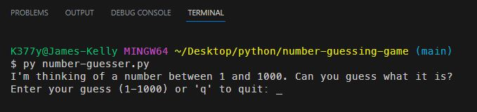
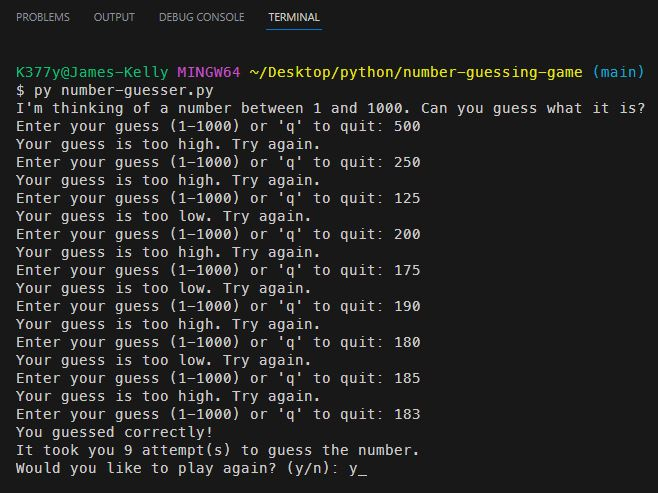
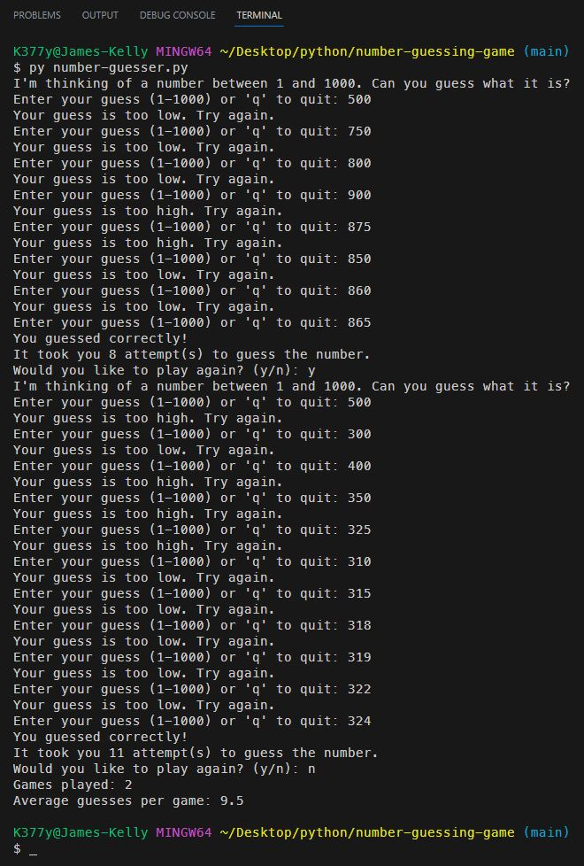

# Number Guessing Game

## *Description*
This is a game where the user guesses the number that the random module generates.  The user is prompted to enter a number between 1 and 100.  If the user guesses correctly, the game ends.  If the user guesses incorrectly, the game will tell the user if the guess was too high or too low.  The user will be prompted to guess again until the correct number is guessed.  The game will keep track of the number of guesses and the number of games played.  The user can quit the game at any time by pressing 'q'.  When the user quits, the game will display the number of games played and the average number of guesses per game.
 

## *Installation*
To install this game, simply clone the repository and run the `number-guesser.py` file in your terminal.
 

## *Usage*
When prompted: 
Press 1, 2, or 3 to select your choice of paper, rock, or scissors.  
Press 'q' to quit and see the totals.
 

 
 

 

## *Questions*
<h3>Portfolio:&emsp;<a href="https://jk377y.dev" target="_blank">https://jk377y.dev</a></h3>
<h3>Email:&emsp;<a href="mailto:jk377y@gmail.com" target="_blank">jk377y@gmail.com</a></h3>
<h3>LinkedIn:&emsp;<a href="https://www.linkedin.com/in/james-kelly-software-developer/" target="_blank">https://www.linkedin.com/in/james-kelly-software-developer/</a></h3>
<h3>GitHub:&emsp;<a href="https://github.com/jk377y" target="_blank">https://github.com/jk377y</a></h3>

## *License*

 Copyright (c) 2023 James Kelly
 Information on this license can be found at: (https://opensource.org/licenses/MIT)